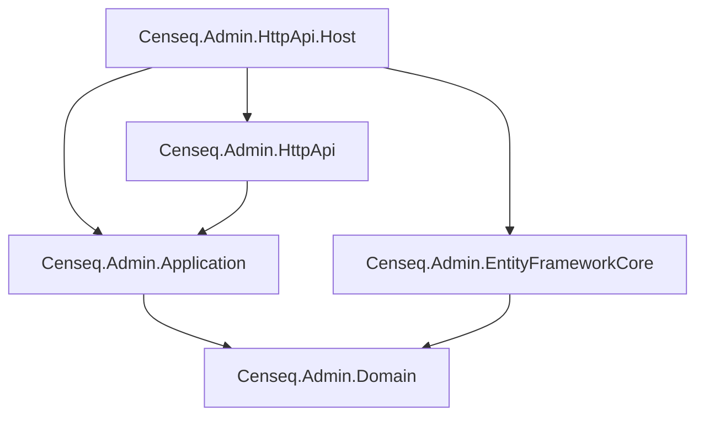
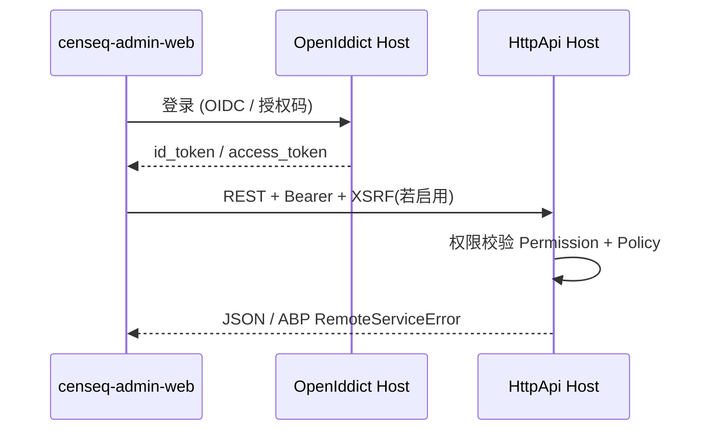
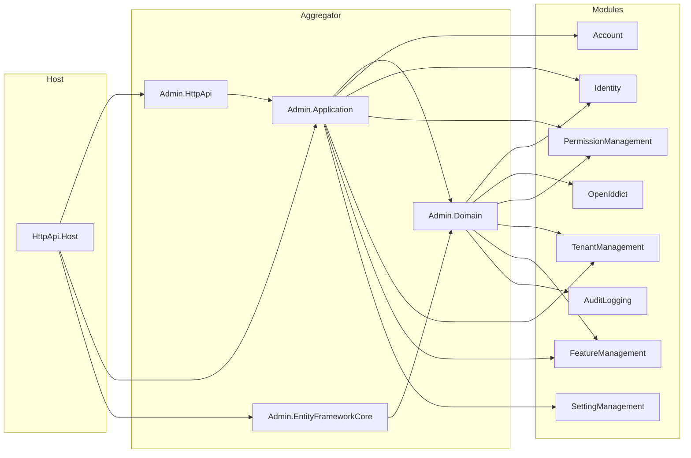

# Censeq Admin 项目架构说明

本文档梳理 `censeq-admin` 仓库内 **后端（ABP/.NET）** 与 **前端（Vue）** 的目录、模块划分、依赖关系与职责边界，便于 onboarding 与二次开发。

---

## 1. 仓库总览

| 路径 | 说明 |
|------|------|
| `censeq-admin-api/` | 后端解决方案：ABP v8 风格分层、模块化业务、统一 Host 与数据库。 |
| `censeq-admin-web/` | 管理端 SPA：**Vue 3 + Vite + Element Plus**，通过 **OpenId Connect** 调用后端 API。 |
| `doc/` | 项目文档（本文件等）。 |
| `src/openiddict-core/`（若存在） | OpenIddict 上游源码/子模块，供本地调试或定制；日常业务以 `censeq-admin-api` 内封装为准。 |

**解决方案入口：** `censeq-admin-api/Censeq.Admin.sln`

---

## 2. 后端分层（ABP DDD 习惯）

每个业务域通常拆为四层（部分模块略有合并）：

| 分层 | 职责 |
|------|------|
| `*.Domain.Shared` | 常量、本地化资源、跨模块共享枚举/错误码等（无业务实现）。 |
| `*.Domain` | 实体、领域服务、仓储接口、领域事件。 |
| `*.Application.Contracts` | 应用服务接口、DTO、权限名常量。 |
| `*.Application` | 应用服务实现、AutoMapper 配置。 |
| `*.EntityFrameworkCore` | EF Core 映射、`DbContext` 扩展、仓储实现。 |
| `*.HttpApi` | `Controller`，对外 HTTP 契约（路由、Area）。 |

**聚合根宿主：** `Censeq.Admin.EntityFrameworkCore` 中的 `CenseqAdminDbContext` 将各模块的 `DbContext` 接口 **Replace** 到同一物理库上下文中（见下文「数据访问」）。

---

## 3. 宿主与入口项目（`censeq-admin-api/src`）

| 项目 | 作用 |
|------|------|
| **Censeq.Admin.HttpApi.Host** | **主 API 宿主**：认证、多租户中间件、Swagger、Serilog、引用 `CenseqAdminHttpApiModule` + EF + Account.Web(OpenIddict) 等，是 **`censeq-admin-web` 主要对接的后端进程**。 |
| **Censeq.Admin.HttpApi** | 聚合各业务模块的 **HttpApi**（控制器应用部件），自身含 Admin 壳资源与少量配置。 |
| **Censeq.Admin.Application** | 聚合各模块 **Application**，配置 Admin 级 AutoMapper / 虚拟文件等。 |
| **Censeq.Admin.Domain** | 聚合核心 **Domain** 模块（Identity、OpenIddict、租户、权限桥接、审计、特性等）。 |
| **Censeq.Admin.EntityFrameworkCore** | **统一数据库上下文**、迁移、动态连接与命名约定（如 snake_case）。 |
| **Censeq.Admin.DbMigrator** | 独立控制台：**数据库迁移与数据种子**执行入口。 |
| **Censeq.Admin.HttpApi.Client** | HTTP API 客户端/代理生成相关（与前端或工具链集成）。 |
| **Censeq.Admin.Web** | 基于 **Razor Pages** 的 Web UI（账户页、部分 Profile 等），与 **SPA 并存**时可作为登录/账户补充界面；主管理界面以 `censeq-admin-web` 为准。 |

**依赖关系（简图）：**

---

## 4. 业务模块一览（`censeq-admin-api/modules`）

以下为当前解决方案中占主导的业务/基础设施模块及其 **主要职责** 与 **典型 API/概念**。具体路由以各模块 `*Controller` 为准。

### 4.1 Identity（身份 / 用户与角色 / 组织单元）

| 子项 | 说明 |
|------|------|
| **作用** | 用户、角色、组织机构（**Organization Unit**，产品侧常称「部门/组织机构」）、用户-OU 关系、与 ASP.NET Identity 集成。 |
| **HttpApi** | 如 `api/identity/users`、`api/identity/roles`、`api/identity/organization-units` 等。 |
| **关联** | 权限模块通过 `Censeq.PermissionManagement.Domain.Identity` 与 Identity 集成；OU 上可挂角色，用户可继承 OU 相关角色（ABP 标准行为）。 |

### 4.2 OpenIddict（认证服务器）

| 子项 | 说明 |
|------|------|
| **作用** | OAuth2/OIDC 授权服务器：客户端、令牌、校验；为 SPA（`oidc-client-ts`）提供 **Authorization Code** 等流程。 |
| **关联** | `Account.Web` / `Account.Web.OpenIddict` 提供登录、同意页等；**Host** 中配置 `OpenIddict` 验证与颁发。 |

### 4.3 Account（账户）

| 子项 | 说明 |
|------|------|
| **作用** | 账户应用服务、与 Web 登录/注册/管理账户页面配合。 |
| **关联** | 依赖 Identity + OpenIddict；前端 OIDC 登录完成后用 **Bearer Token** 调业务 API。 |

### 4.4 PermissionManagement（权限管理）

| 子项 | 说明 |
|------|------|
| **作用** | 权限定义持久化、按 **Provider**（如 Role `R`、User、Client）授权、权限查询与批量更新；支撑 **RBAC + 命名权限** 模型。 |
| **HttpApi** | 如 `api/permission-management/permissions`。 |
| **关联** | 与 Identity、OpenIddict 分别有 Domain 桥接模块；种子数据可为 `admin` 角色授予全部业务权限。 |

### 4.5 TenantManagement（多租户）

| 子项 | 说明 |
|------|------|
| **作用** | 租户 CRUD、默认连接串、租户创建后数据播种钩子（与 `IDataSeeder` 协作）。 |
| **HttpApi** | 如 `api/multi-tenancy/tenants`。 |
| **关联** | `MultiTenancyConsts.IsEnabled` 控制是否启用多租户；特性/功能模块可为租户级功能做策略校验。 |

### 4.6 FeatureManagement（特性/功能开关）

| 子项 | 说明 |
|------|------|
| **作用** | 功能项定义与取值（常与 **Edition/Tenant** 搭配），用于「套餐能力」或租户级开关。 |
| **关联** | 权限定义中可引用 Feature 的 **StateChecker**；与 TenantManagement 协同。 |

### 4.7 SettingManagement（设置）

| 子项 | 说明 |
|------|------|
| **作用** | 系统/租户/用户级设置存取（如邮件、时区等）。 |
| **HttpApi** | 如 `api/setting-management/...`（以具体 Controller 为准）。 |

### 4.8 AuditLogging（审计日志）

| 子项 | 说明 |
|------|------|
| **作用** | 记录操作审计（谁在何时改了什么），持久化到 EF。 |
| **关联** | 与统一 `DbContext` 集成，随宿主启用。 |

### 4.9 basic-theme / Framework.*（基础与横切）

| 路径 | 说明 |
|------|------|
| `framework/Censeq.Framework.Core` | 公共 ABP 模块基类等。 |
| `framework/Censeq.Framework.AspNetCore` | ASP.NET Core 公共配置。 |
| `framework/Censeq.Framework.Swashbuckle` | Swagger/OpenAPI 集成。 |
| `modules/basic-theme/...Theme.Basic` | ABP UI 基础主题（Host 中引用，用于内置 Razor 页面风格等）。 |

### 4.10 users（Starshine.Abp.Users.*）

| 子项 | 说明 |
|------|------|
| **作用** | 命名空间为 `Censeq.Abp.Users` 的用户扩展领域/EF，可在 Identity 之上补足扩展用户表或行为（以实际引用为准）。 |

---

## 5. 数据访问与统一 DbContext

- **核心类：** `CenseqAdminDbContext`（`Censeq.Admin.EntityFrameworkCore`）。
- **机制：** 对各模块 `IXxxDbContext` 执行 **`ReplaceDbContext`**，使 Identity、OpenIddict、Permission、Setting、Tenant、Feature、Audit 等 **共用同一数据库**（或同一迁移管线），便于运维与事务边界一致。
- **迁移：** 由 **DbMigrator** 或设计时工厂生成/应用迁移；连接串与 Provider（如 PostgreSQL/SQLite）由配置驱动，并使用 **snake_case** 等与库表一致约定。

---

## 6. 认证、授权与前端调用链（概念）

- **权限模型：** 以 **权限名字符串** 为粒度，`[Authorize("PermissionName")]`；通过 **角色/用户/客户端** 等 Provider **授予（Grant）**。
- **与 RBAC 关系：** 日常是 **用户 → 角色 → 权限**；OU 可带来 **组织继承角色**，属于 ABP 对 RBAC 的扩展。

---

## 7. 多租户（Multi-Tenancy）

- 开关：**`Censeq.Admin.Domain.Shared/MultiTenancy/MultiTenancyConsts.IsEnabled`**（当前为 `true`）。
- **租户解析** 由 ABP 中间件根据域名/头/路由等策略完成（具体以 Host 配置为准）。
- **租户管理 API** 一般在 **宿主（Host）侧** 使用；业务数据通过 `IMultiTenant` 实体与 `TenantId` 隔离。

---

## 8. 前端 `censeq-admin-web`

| 项 | 说明 |
|----|------|
| **技术栈** | Vue 3、Vite、Element Plus、Pinia、axios、`oidc-client-ts`。 |
| **配置** | `VITE_API_URL` 指向后端 API 基地址；请求封装在 `src/utils/request.ts`（Bearer、XSRF、ABP 错误体解析等）。 |
| **API 组织** | `src/api/apis`（如 `identity`、`tenant-management`、`permission-management`），`src/api/models` 与后端 DTO 对齐。 |
| **路由** | `src/router`：支持前端静态路由与后端菜单驱动（按项目 `isRequestRoutes` 等开关）。 |
| **已实现业务页（示例）** | 系统管理：菜单/角色/用户/**部门（OU 树）**/字典、租户管理等视图位于 `src/views/system`。 |

前端 **不实现** 权限引擎，只做 **菜单可见性** 与 **按钮控制**（可与后端权限名对齐）；**最终鉴权以后端为准**。

---

## 9. 模块依赖关系（后端·示意）

> 注：图中为 **逻辑依赖**；实际还有 `PermissionManagement.Domain.Identity`、`PermissionManagement.Domain.OpenIddict` 等 **桥接模块** 未单独画出。

---

## 10. 文档维护

- 若新增业务模块：在本文件 **§4** 增加小节，并更新 **§9** 示意或改为链接到模块内 README。
- 若关闭多租户：除修改 `MultiTenancyConsts` 外，应审查 Tenant / Feature / 连接串相关文档与运维脚本。

---

*生成自当前仓库结构梳理；接口路径与类名以实际代码为准。*
